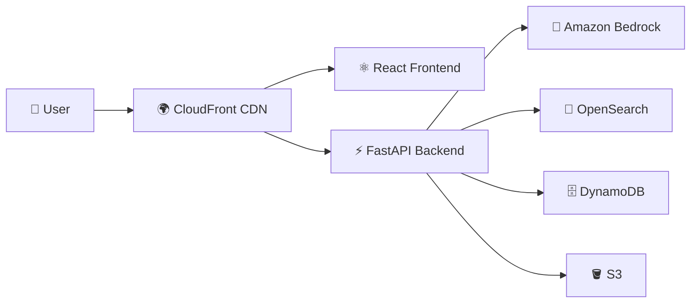

<div align="center">

# 🤖 E-Commerce Customer Support AI Chatbot

### ✨ Enterprise-Grade AWS-Native AI Solution with RAG | Built for Scale & Learning

<p align="center">
  
  
  
  
</p>

<p align="center">
  
  
  
  
</p>

<p align="center">
  
  
  
  
</p>

<p align="center">
  
  
  
  
  
</p>

<p align="center">
  <a href="#-features">Features</a> •
  <a href="#-architecture">Architecture</a> •
  <a href="#-quick-start">Quick Start</a> •
  <a href="#-documentation">Docs</a> •
  <a href="#-contact">Contact</a>
</p>

---

### 🎯 **Built for Portfolio Excellence, Production-Ready Architecture**

</div>

---

## 🌟 Overview

> A **complete, enterprise-grade AI chatbot solution** demonstrating modern AWS cloud architecture, AI/ML integration, and production-ready engineering practices.

This project showcases:

<table>
  <tr>
    <td align="center">🏆<br/><b>Portfolio Excellence</b><br/>GitHub showcase-ready</td>
    <td align="center">☁️<br/><b>Cloud Architecture</b><br/>AWS-native design</td>
    <td align="center">🧠<br/><b>AI Integration</b><br/>Bedrock + RAG pattern</td>
    <td align="center">📖<br/><b>Documentation</b><br/>Enterprise-level docs</td>
  </tr>
</table>

### 💡 What This Chatbot Does

<table>
  <tr>
    <td>💬 <b>Interactive Chat</b></td>
    <td>Real-time conversational interface with modern UI</td>
  </tr>
  <tr>
    <td>🧠 <b>LLM-Powered</b></td>
    <td>Amazon Bedrock (Claude 3.5 Sonnet) for intelligent responses</td>
  </tr>
  <tr>
    <td>📚 <b>RAG Integration</b></td>
    <td>Retrieval-Augmented Generation for grounded answers</td>
  </tr>
  <tr>
    <td>📦 <b>Order Help</b></td>
    <td>Mock order lookup and status tracking</td>
  </tr>
  <tr>
    <td>🔗 <b>Source Citations</b></td>
    <td>Transparent reference to knowledge base sources</td>
  </tr>
  <tr>
    <td>💾 <b>Session Memory</b></td>
    <td>Persistent conversation history with DynamoDB</td>
  </tr>
  <tr>
    <td>🏗️ <b>IaC Deployment</b></td>
    <td>Complete Terraform-based infrastructure automation</td>
  </tr>
</table>

---

## 🏛️ Architecture

<div align="center">

### 🎨 **Modern Cloud-Native Design**

</div>



### 🔧 Core Services

<table>
  <tr>
    <th>Layer</th>
    <th>Service</th>
    <th>Purpose</th>
    <th>Technology</th>
  </tr>
  <tr>
    <td>🎨 <b>Frontend</b></td>
    <td>Web UI</td>
    <td>Interactive chat interface</td>
    <td>React + TypeScript + Vite</td>
  </tr>
  <tr>
    <td>⚙️ <b>Backend</b></td>
    <td>API Server</td>
    <td>Orchestration & business logic</td>
    <td>FastAPI + Python 3.11</td>
  </tr>
  <tr>
    <td>🧠 <b>AI Engine</b></td>
    <td>LLM</td>
    <td>Response generation</td>
    <td>Amazon Bedrock (Claude 3.5)</td>
  </tr>
  <tr>
    <td>📚 <b>Knowledge Base</b></td>
    <td>Search</td>
    <td>FAQ/policy retrieval</td>
    <td>Amazon OpenSearch Service</td>
  </tr>
  <tr>
    <td>💾 <b>State Store</b></td>
    <td>Sessions</td>
    <td>Conversation persistence</td>
    <td>Amazon DynamoDB</td>
  </tr>
  <tr>
    <td>🪣 <b>Storage</b></td>
    <td>Objects</td>
    <td>Documents & static assets</td>
    <td>Amazon S3</td>
  </tr>
  <tr>
    <td>🚀 <b>Compute</b></td>
    <td>Containers</td>
    <td>Serverless container hosting</td>
    <td>Amazon ECS Fargate</td>
  </tr>
  <tr>
    <td>🌍 <b>Edge</b></td>
    <td>CDN</td>
    <td>Global content delivery</td>
    <td>Amazon CloudFront</td>
  </tr>
  <tr>
    <td>📊 <b>Monitoring</b></td>
    <td>Observability</td>
    <td>Logs, metrics, alarms</td>
    <td>Amazon CloudWatch</td>
  </tr>
  <tr>
    <td>🔐 <b>Security</b></td>
    <td>Secrets</td>
    <td>Credential management</td>
    <td>AWS Secrets Manager</td>
  </tr>
</table>

---

<div align="center">

### 🔄 **RAG Architecture Flow**

</div>

```
┌─────────────────────────────────────────────────────────────────┐
│                     User Interaction Flow                        │
└─────────────────────────────────────────────────────────────────┘

  1️⃣  User asks: "What is your shipping policy?"
           ⬇️
  2️⃣  Backend queries OpenSearch for relevant FAQ documents
           ⬇️
  3️⃣  Top-3 documents retrieved with relevance scores
           ⬇️
  4️⃣  Context + user question → prompt construction
           ⬇️
  5️⃣  Prompt sent to Amazon Bedrock (Claude 3.5 Sonnet)
           ⬇️
  6️⃣  LLM generates grounded response
           ⬇️
  7️⃣  Frontend displays answer + source citations
```

> **✨ Why RAG?** Reduces hallucination, improves accuracy, provides transparency

---

## 🚀 Quick Start

<details open>
<summary><b>📋 Prerequisites</b></summary>

<br/>

```bash
✅ AWS CLI v2+
✅ Terraform >= 1.6.0
✅ Docker
✅ Python 3.11+
✅ Node.js 20+
✅ jq
✅ Git
```

**AWS Requirements:**
- ☁️ Active AWS account
- 🔑 IAM permissions for deployment
- 🧠 Bedrock model access enabled

</details>

---

### 📦 Installation Steps

<details>
<summary><b>1️⃣ Clone Repository</b></summary>

```bash
git clone https://github.com/LearningGallery/ecommerce-support-chatbot.git
cd ecommerce-support-chatbot
```

</details>

<details>
<summary><b>2️⃣ Configure Terraform</b></summary>

```bash
cd terraform
cp terraform.tfvars.example terraform.tfvars
vim terraform.tfvars  # Edit with your values
```

**Required variables:**
```hcl
project_name = "ecommerce-chatbot"
environment  = "dev"
owner_email  = "your-email@example.com"
aws_region   = "ap-southeast-1"
```

</details>

<details>
<summary><b>3️⃣ Deploy Infrastructure</b></summary>

```bash
terraform init
terraform plan -out=tfplan
terraform apply tfplan
```

⏱️ **Estimated time:** 15-20 minutes (OpenSearch provisioning)

</details>

<details>
<summary><b>4️⃣ Build & Push Docker Images</b></summary>

```bash
cd ..
chmod +x scripts/*.sh
./scripts/build-and-push.sh
```

</details>

<details>
<summary><b>5️⃣ Deploy Services & Load Data</b></summary>

```bash
./scripts/deploy.sh
```

This script:
- ✅ Updates ECS services
- ✅ Initializes OpenSearch index
- ✅ Loads sample FAQ data
- ✅ Validates deployment

</details>

<details>
<summary><b>6️⃣ Validate Deployment</b></summary>

```bash
./scripts/health-check.sh
```

**Expected output:**
```
✅ Backend is healthy
✅ CloudFront is accessible
  Bedrock:    healthy
  OpenSearch: healthy
  DynamoDB:   healthy
```

</details>

---

## 💬 Demo Usage

<div align="center">

### Try These Sample Questions

</div>

| Question Type | Example Query |
|--------------|---------------|
| 🚚 **Shipping** | "What is your shipping policy?" |
| 🔄 **Returns** | "How do returns work?" |
| 💳 **Payment** | "What payment methods do you accept?" |
| ❌ **Cancellation** | "Can I cancel my order?" |
| 📦 **Order Tracking** | "Track my order ORD-123456" |

---

## 📚 Documentation

<div align="center">

### 🗂️ **Comprehensive Documentation Pack**

</div>

<table>
  <tr>
    <th>📖 Document</th>
    <th>📝 Description</th>
  </tr>
  <tr>
    <td><a href="docs/ARCHITECTURE.md">🏗️ Architecture</a></td>
    <td>Complete system design, HLD, LLD, AI architecture</td>
  </tr>
  <tr>
    <td><a href="docs/DEPLOYMENT-GUIDE.md">🚀 Deployment Guide</a></td>
    <td>Step-by-step deployment instructions</td>
  </tr>
  <tr>
    <td><a href="docs/RUNBOOK.md">🛠️ Runbook</a></td>
    <td>Daily operations, monitoring, maintenance</td>
  </tr>
  <tr>
    <td><a href="docs/TROUBLESHOOTING.md">🧯 Troubleshooting</a></td>
    <td>Common issues, diagnostics, resolutions</td>
  </tr>
  <tr>
    <td><a href="docs/DATA-MODEL.md">🗃️ Data Model</a></td>
    <td>DynamoDB schema, OpenSearch index design</td>
  </tr>
  <tr>
    <td><a href="docs/API-REFERENCE.md">🔌 API Reference</a></td>
    <td>Complete API endpoint documentation</td>
  </tr>
  <tr>
    <td><a href="docs/RESPONSIBLE-AI.md">🧠 Responsible AI</a></td>
    <td>AI safety, ethics, guardrails, limitations</td>
  </tr>
  <tr>
    <td><a href="docs/PRODUCTION-CHECKLIST.md">✅ Production Checklist</a></td>
    <td>Production readiness validation</td>
  </tr>
</table>

---

### 📄 Architecture Decision Records (ADRs)

<table>
  <tr>
    <td><a href="docs/adrs/001-use-amazon-bedrock.md">ADR-001</a></td>
    <td>🧠 Use Amazon Bedrock for LLM</td>
  </tr>
  <tr>
    <td><a href="docs/adrs/002-use-opensearch-for-rag.md">ADR-002</a></td>
    <td>🔎 Use OpenSearch for RAG Retrieval</td>
  </tr>
  <tr>
    <td><a href="docs/adrs/003-use-ecs-fargate.md">ADR-003</a></td>
    <td>🚀 Use ECS Fargate for Compute</td>
  </tr>
  <tr>
    <td><a href="docs/adrs/004-use-dynamodb-for-sessions.md">ADR-004</a></td>
    <td>💾 Use DynamoDB for Sessions</td>
  </tr>
  <tr>
    <td><a href="docs/adrs/005-use-rag-pattern.md">ADR-005</a></td>
    <td>🧩 Use RAG Pattern for Grounding</td>
  </tr>
</table>

---

## 📂 Project Structure

```
ecommerce-support-chatbot/
│
├── 🏗️  terraform/          # Infrastructure as Code
│   ├── main.tf
│   ├── variables.tf
│   ├── outputs.tf
│   └── modules/
│       ├── networking/
│       ├── opensearch/
│       ├── ecs/
│       ├── dynamodb/
│       ├── s3/
│       ├── cloudfront/
│       ├── secrets/
│       └── monitoring/
│
├── ⚙️  backend/            # FastAPI Backend
│   ├── main.py
│   ├── Dockerfile
│   ├── config/
│   ├── api/
│   ├── services/
│   ├── models/
│   └── utils/
│
├── 🎨 frontend/            # React Frontend
│   ├── src/
│   │   ├── components/
│   │   ├── services/
│   │   ├── hooks/
│   │   └── types/
│   ├── Dockerfile
│   └── nginx.conf
│
├── 🔧 workers/             # Ingestion Workers
│   ├── ingestion/
│   └── sample-data/
│
├── 🛠️  scripts/            # Deployment Scripts
│   ├── build-and-push.sh
│   ├── deploy.sh
│   ├── health-check.sh
│   └── load-sample-data.sh
│
├── 📚 docs/                # Documentation
│   ├── ARCHITECTURE.md
│   ├── DEPLOYMENT-GUIDE.md
│   ├── RUNBOOK.md
│   └── adrs/
│
└── 📊 diagrams/            # Architecture Diagrams
    ├── runtime-architecture.mmd
    ├── chatbot-request-flow.mmd
    └── rag-flow.mmd
```

---

## 🎯 Current Scope

<table>
  <tr>
    <th>✅ Included</th>
    <th>🚧 Future Enhancements</th>
  </tr>
  <tr>
    <td valign="top">
      • Full Terraform infrastructure<br/>
      • Frontend chat UI<br/>
      • Backend orchestration<br/>
      • Bedrock integration<br/>
      • OpenSearch-based RAG<br/>
      • DynamoDB session handling<br/>
      • FAQ ingestion worker<br/>
      • CloudWatch monitoring<br/>
      • Comprehensive documentation<br/>
      • ADR pack<br/>
      • Mermaid diagrams
    </td>
    <td valign="top">
      • Amazon Cognito authentication<br/>
      • Real OMS/ERP integration<br/>
      • Bedrock Guardrails<br/>
      • CI/CD pipeline (GitHub Actions)<br/>
      • Multi-region deployment<br/>
      • Blue-green deployment<br/>
      • A/B testing framework<br/>
      • Advanced analytics dashboard<br/>
      • Slack/Teams integration<br/>
      • Custom domain + ACM
    </td>
  </tr>
</table>

---

## 🧰 Technology Stack

<div align="center">

### **Cloud & Infrastructure**


### **AI & Search**


### **Application Stack**


### **AWS Services**


</div>

---

## 🔐 Security

<div align="center">

### **Built with Security Best Practices**

</div>

<table>
  <tr>
    <td>🛡️ <b>Network</b></td>
    <td>VPC isolation, private subnets, security groups</td>
  </tr>
  <tr>
    <td>🔑 <b>IAM</b></td>
    <td>Least-privilege roles, no hardcoded credentials</td>
  </tr>
  <tr>
    <td>🔐 <b>Encryption</b></td>
    <td>At rest (S3, DynamoDB, OpenSearch) + in transit (TLS 1.2+)</td>
  </tr>
  <tr>
    <td>🗝️ <b>Secrets</b></td>
    <td>AWS Secrets Manager integration</td>
  </tr>
  <tr>
    <td>🧹 <b>Input Safety</b></td>
    <td>Sanitization, PII detection, validation</td>
  </tr>
  <tr>
    <td>📋 <b>Logging</b></td>
    <td>CloudWatch Logs, VPC Flow Logs</td>
  </tr>
</table>

> 🔗 **For production hardening:** See [SECURITY.md](SECURITY.md) and [Production Checklist](docs/PRODUCTION-CHECKLIST.md)

---

## 💰 Cost Estimation

<details>
<summary><b>💵 Monthly Cost Breakdown (Demo Environment)</b></summary>

<br/>

| Service | Configuration | Est. Cost |
|---------|---------------|-----------|
| ECS Fargate | 4 tasks (0.5 vCPU, 1GB) | ~$72 |
| OpenSearch | t3.small.search, 10GB | ~$50 |
| DynamoDB | On-demand | $0 (free tier) |
| S3 | <100GB | ~$2 |
| CloudFront | <1TB transfer | ~$10 |
| ALB | 2 load balancers | ~$35 |
| CloudWatch | Logs & metrics | ~$5 |
| NAT Gateway | 2 gateways | ~$65 |
| Bedrock | ~100K tokens/day | ~$15 |
| **Total** | | **~$254/month** |

> 💡 **Cost optimization tips in [docs/ARCHITECTURE.md](docs/ARCHITECTURE.md)**

</details>

---

## 📸 Screenshots & Demo

> **Coming Soon:** Add screenshots of:
> - Chat UI in action
> - CloudWatch dashboard
> - OpenSearch queries
> - Architecture diagrams

---

## 🤝 Contributing

Contributions are welcome! Please see [CONTRIBUTING.md](CONTRIBUTING.md) for guidelines.

---

## 📞 Contact

<div align="center">

### **AbuTalha**

[](https://linkedin.com/in/Im-AbuTalha)
[](https://github.com/LearningGallery)

</div>

---

## 📄 License

<div align="center">

[](https://opensource.org/licenses/MIT)

This project is licensed under the **MIT License** - see the [LICENSE](LICENSE) file for details.

</div>

---

<div align="center">

### ⭐ **If you find this project helpful, please give it a star!** ⭐

<p align="center">
  
  
  
</p>

**Built with ❤️ for the AWS & AI Community**

</div>